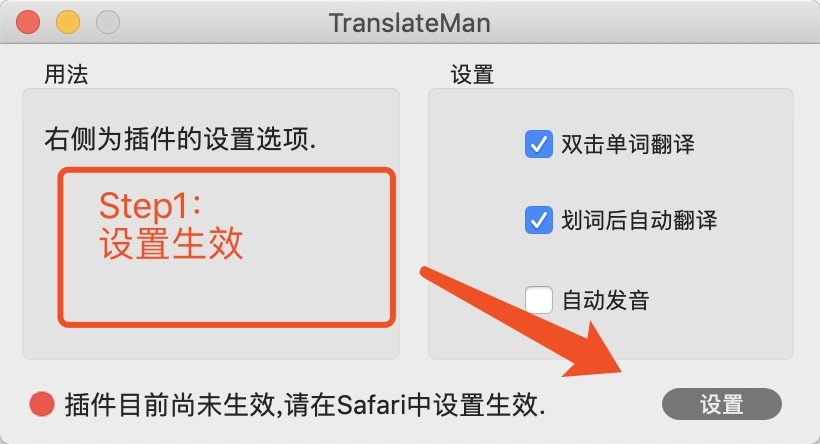
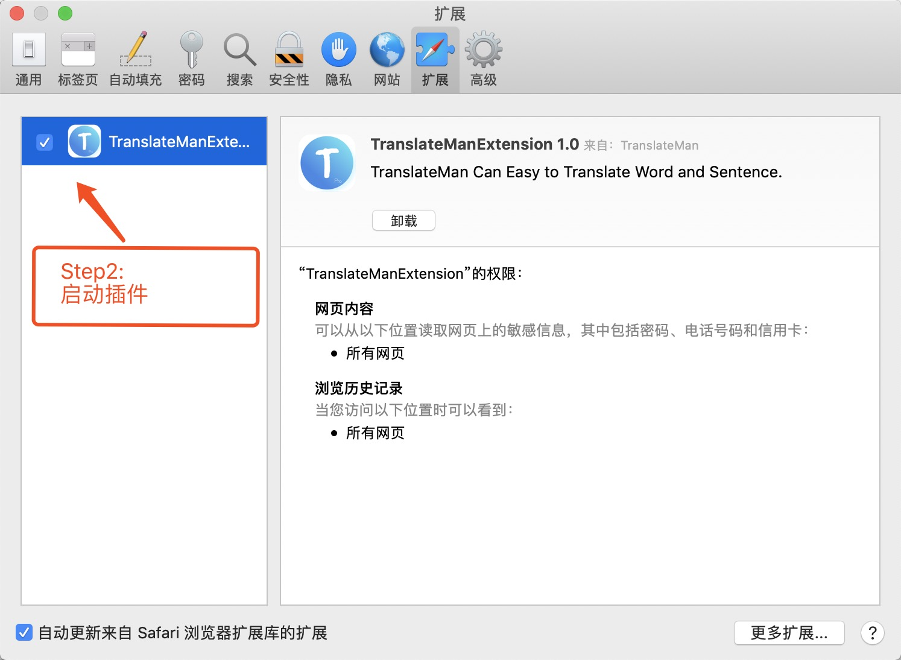
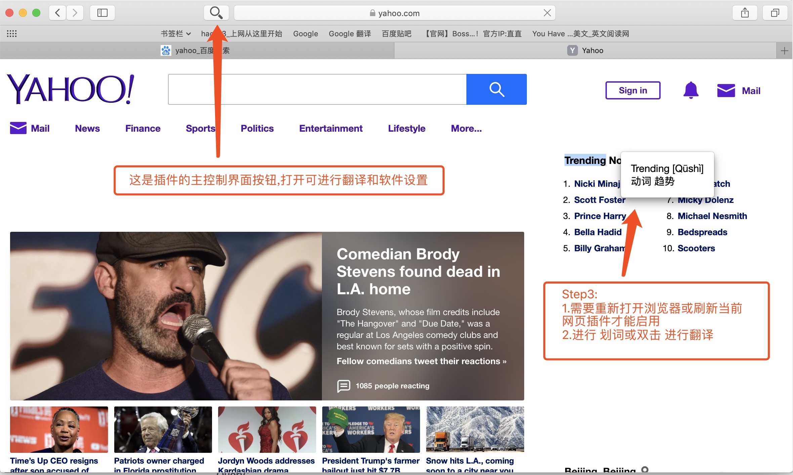

#TranslateMan for Safari Instructions for use

## Operation Guide

### 1. Setting the enable plugin
      (1) Click Settings in the software.
      (2) Set TranslateMan to ON in the Safari plugin settings
      (3) Return to the software to see if the plugin status has been changed to boot and software settings

### 2. Start Safari and use
      (1) After the plugin is enabled, the user needs to restart the Safari browser or refresh the current page (refresh to inject the plugin translation code into the page)
      (2) Select the text by double-clicking and double-clicking, and pop up the translation pop-up after a slight delay.
      (3) The software main interface can be more accurate translation and multi-language translation, and can also set the plug-in startup status.

### 3. Graphic operation

## Questions and Answers

### 1. What should I do if I use a word on the page or double click to not display the translation window?
      (1) The first version of the software only supports English->Chinese on the webpage. For other language settings, please wait for the subsequent version to join.
      (2) After the plugin is enabled, you must restart Safari browser or refresh the current web page to take effect (refresh to inject the plugin translation code into the page)
      (3) Some statements do not display the translation popup, it may be a Google service translation error, is being investigated..

### 2. The translated content is not rich enough. What should I do without the results of Google translation?
      Currently, the display UI and translation results are upgraded. More translations such as (synonyms, example sentences, etc.) will be added in subsequent versions.

### 3. What can I do if I can't find a supported language?
      Click on Software Settings -> Language to set. If not, please contact me to add.
   
### 4. What should I do if I have seen the above guidelines and software usage problems?
      Can contact swain6@163.com for the first time to solve the problem, the software will be more perfect

